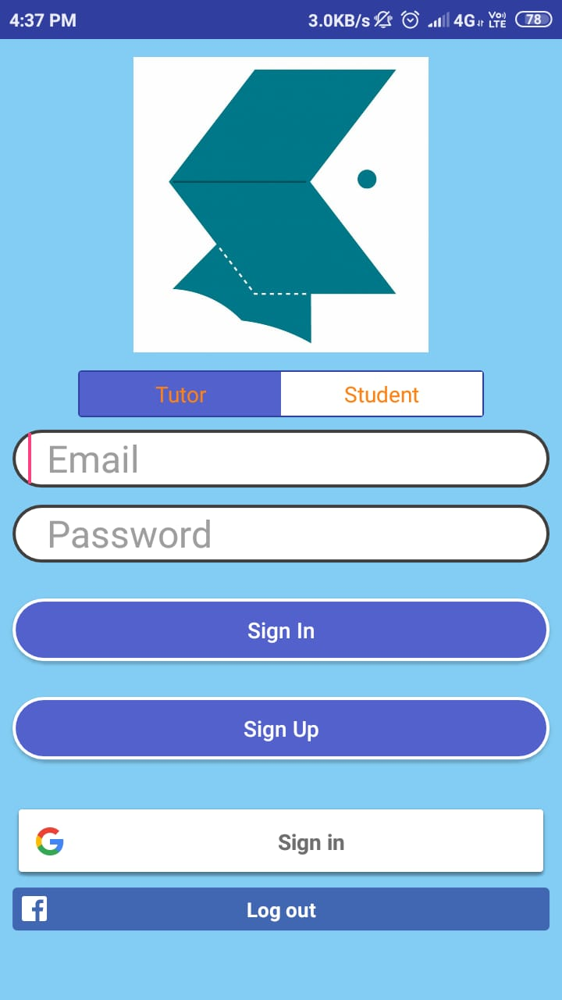
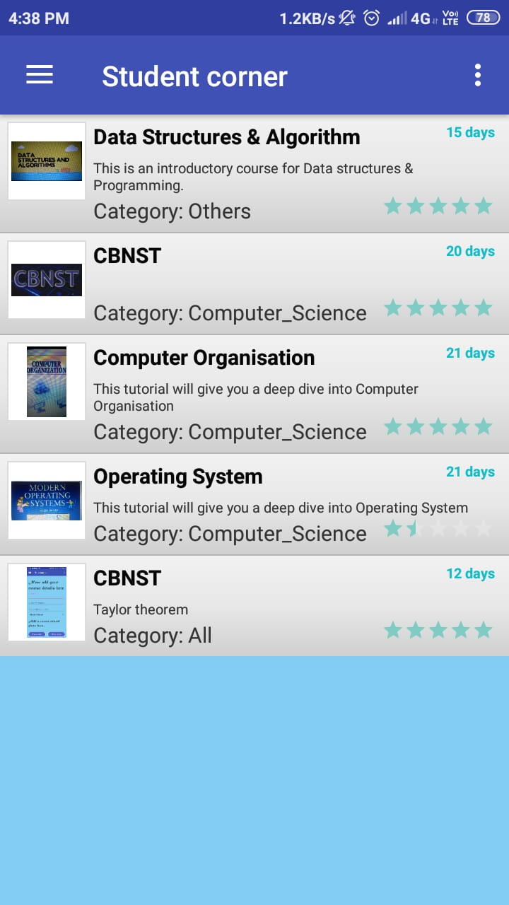
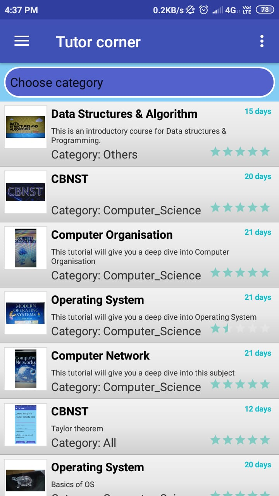
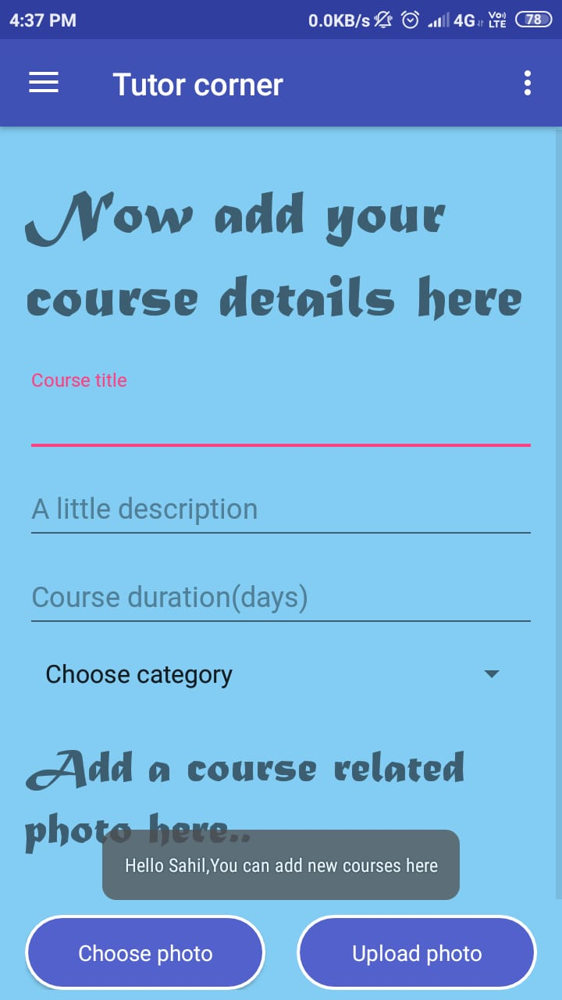
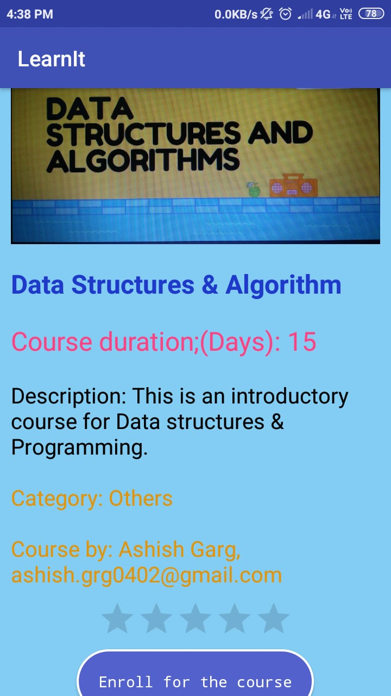
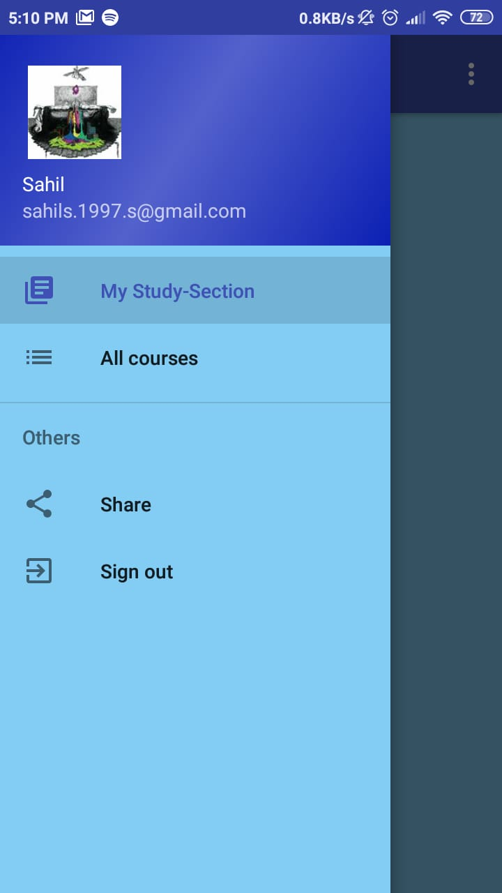
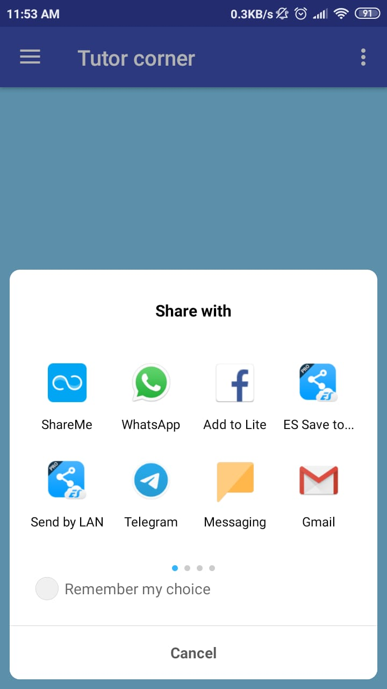
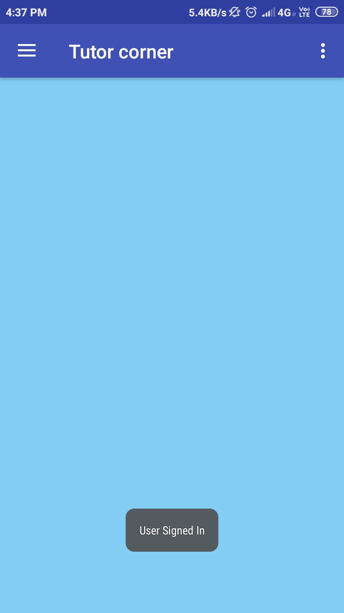

# LearnIt

An Android based study portal through which students can access various video lecture courses via YouTube.

##  Features
- A one-click simple application to enroll for various courses
-	The tutor as well as the Student can SignUp/SignIn via the same app
- Login Authentication can be done by:
      >Google
      >Facebook
      >Email Authentication
- Users can add various courses which will be updated in Realtime.
- Students can also rate the courses as well
- Students can check all the courses that he/she have enrolled for in a complete different list
- Tutors can check the list of courses that they have added
- A list of videos can we watched after selecting the course in your course-list.

## Screenshots:

## Libraries & API:

- FirebaseAuthentication
- FirebaseDatabase
- FacebookLogin
- YoutubeAPI
- Glide(For loading Images)

## Assumptions:
- The tutor has added video lectures already in Youtube
- User knows how to operate basic features of mobile phone.
- Phone has internet connectivity.
- Phone has basic Google Play services installed
    

### About this project:
- This was a freelancing project develeoped for Ashish Garg (Contact: ashish.grg0402@gmail.com)
    > Note:This was made by me alone in just a span of 46 hours, yes it was that short.
    
### Support:
What do you think about this?Contact:
- [Sahil](https://www.github.com/imsahil007)

### Todos
 - Make the UI more interactive
